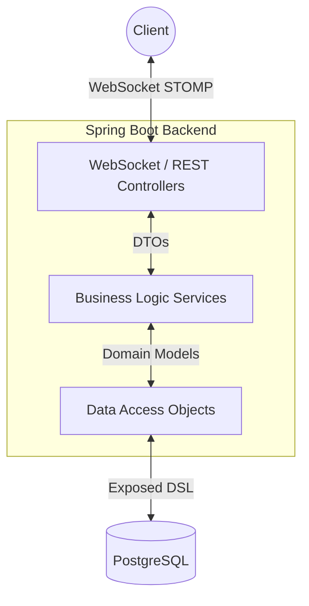
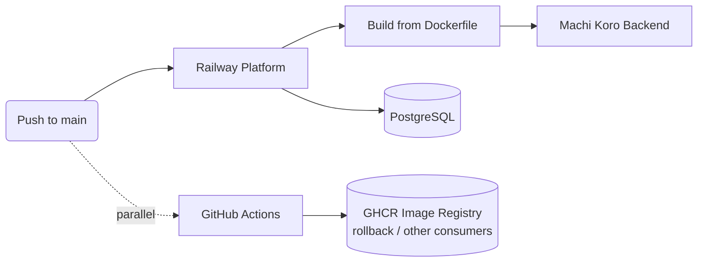

# Machi Koro Server

[](https://github.com/SE2-Machi-Koro/Server/actions/workflows/ci.yml)
[](https://sonarcloud.io/summary/new_code?id=SE2-Machi-Koro_Server)

> Robust real-time multiplayer backend for the Machi Koro board game, built with Kotlin, Spring Boot, and WebSockets.

This server manages real-time Machi Koro game sessions, player communication, game state, and persistent storage on
PostgreSQL. Designed for reliability, scalability, and developer productivity.

## Key Features

- **Real-Time Multiplayer:** Instant bidirectional communication using STOMP over WebSockets.
- **Game State Management:** Strict tracking of turn phases (Roll Dice, Resolve Effects, Buy/Build, End Turn) and game
  statuses.
- **Game Logic Engine:** Calculates earnings, applies card effects based on dice rolls, and detects win conditions (
  e.g., landmark completion).
- **Authoritative Turns:** Clients request roll, resolve, purchase, and end-turn actions; only the server advances legal phases.
- **In-Game Chat:** Built-in chat system for players in the lobby and during the game.
- **Cheating & Accusations:** Optional Insider Trading cheat with a player-vs-player accusation flow; the server adjudicates and penalizes the caught cheater or a wrong accuser. In the client, the **"rules"** text opens the game's rulebook PDF and the cheating function.
- **Accounts & Authentication:** REST registration, login, and logout with token-based session authentication, enforced
  for both REST calls and STOMP WebSocket sessions.
- **Leaderboard:** REST endpoint exposing player rankings across finished games.
- **Data Persistence:** Uses JetBrains Exposed ORM to safely store users, games, cards, and landmarks in PostgreSQL.
- **Quality Assured:** Comprehensive test suite with Testcontainers, JUnit5, and a strict ≥80% Jacoco coverage quality
  gate.

## Tech Stack

- **Language:** Kotlin 2.2.21 (JDK 21 toolchain)
- **Framework:** Spring Boot 4.0.3
- **Security:** Spring Security with token-based session authentication
- **Database:** PostgreSQL 18.0
- **Database Migrations:** Flyway - Handles database schema migrations automatically on startup, ensuring the database structure is always in sync with the codebase.
- **ORM:** JetBrains Exposed 1.0.0 (DSL only)
- **Real-Time Communication:** Spring WebSockets (STOMP / SockJS)
- **API Documentation:** Springdoc OpenAPI (Swagger UI) 3.0.2
- **AsyncAPI Documentation:** Springwolf 2.3.0 - Auto-generates AsyncAPI documentation for the WebSocket endpoints, allowing developers to explore and interact with message channels directly from the browser.
- **Testing:** JUnit 5, Mockito-Kotlin, Testcontainers
- **Containerization:** Docker & Docker Compose

## Architecture Overview

The project follows a standard multi-layer Spring Boot architecture:



- **Controllers (`controller/`):** Expose WebSocket and REST endpoints (e.g., `GameController`, `WebSocketController`).
- **Services (`service/`):** Contain the core game logic (`GamePhaseService`, `EarningsService`, `WinConditionService`).
- **Domain Models (`domain/`):** Pure Kotlin data classes representing the business logic and game state (`GameModel`,
  `PlayerModel`, Enums like `TurnPhase`).
- **Data Access (`dao/`):** DAOs interact directly with the database using Exposed DSL and map raw results to domain
  models.
- **DTOs (`dto/`):** Data Transfer Objects for client-server communication.
- **Configuration (`config/`):** Setup for WebSockets, Spring Security, and OpenAPI.
- **Authentication (`auth/`):** Token authentication filter for REST plus a STOMP channel interceptor and user
  principal handling for WebSocket sessions.
- **Exception Handling (`exception/`, `handler/`):** Domain exceptions with dedicated REST and WebSocket exception
  handlers.
- **Database Bootstrap (`database/`):** Exposed table definitions, datasource wiring, and reference-data seeding.
- **Listeners (`listener/`):** WebSocket connect/disconnect event handling.

## Data Layer Concepts

### Data Access Objects (DAOs)

DAOs are the only layer that directly interacts with the database.
Each DAO encapsulates all database operations for its domain (e.g., games, players, cards) and is used by the service
layer to retrieve and modify state.

Key responsibilities:

- Execute all queries inside a transaction
- Use JetBrains Exposed DSL to interact with the persistence layer
- Return domain models instead of raw rows, keeping persistence details isolated from the rest of the application

### Exposed DSL

This project uses JetBrains Exposed exclusively in DSL (Domain-Specific Language) mode — a type-safe, SQL-like query
builder that gives full, explicit control over every database operation.

Unlike an ORM's entity/object approach, the DSL does not hide what SQL runs behind the scenes. Every query is written
explicitly and maps directly to the SQL it produces:

```kotlin
// Select
Games.selectAll()
    .where { Games.status eq GameStatus.WAITING }
    .map { it.toModel() }

// Insert
Games.insertAndGetId {
    it[Games.lobbyCode] = "ABC123"
    it[Games.status] = GameStatus.WAITING
}.value

// Update
Games.update({ Games.id eq id }) {
    it[Games.turnPhase] = TurnPhase.ROLL_DICE
}

// Delete
Games.deleteWhere { Games.id eq id }
```

Table definitions are written as Kotlin objects and serve as the single source of truth for the schema:

```kotlin
object Games : IntIdTable("games") {
    val lobbyCode = varchar("lobby_code", 7).uniqueIndex()
    val status = enumerationByName("status", 20, GameStatus::class)
    val turnPhase = enumerationByName("turn_phase", 20, TurnPhase::class)
}
```

### ResultRow and toModel()

When the DSL executes a query, it returns `ResultRow` objects — essentially a raw map of column references to their
values for a single database row. These are internal to Exposed and must be converted into domain models before leaving
the DAO.

Each DAO defines a private `ResultRow.toModel()` extension function that performs this mapping:

```kotlin
private fun ResultRow.toModel() = GameModel(
    id = this[Games.id].value,
    status = this[Games.status],
    lobbyCode = this[Games.lobbyCode],
    turnPhase = this[Games.turnPhase]
)
```

Column values are accessed by referencing the table column directly (e.g., `this[Games.status]`), which is fully
type-safe — accessing a column that does not exist in the result or reading it as the wrong type is caught at compile
time.

This pattern keeps the mapping logic close to where it is used, and ensures that no Exposed types ever leak outside the
DAO layer. Services and controllers only ever see clean domain models.

### Domain Models

Domain models represent the data used in the application's core business logic.

They are pure Kotlin data classes that encapsulate business state independently of persistence frameworks and transport
layers. These models are used primarily by the service layer to implement game rules and manage the overall game state.

Key characteristics:

- Encapsulate pure business data independent of persistence and frameworks
- Used by the service layer to implement game logic
- Represent the current game state and rule-related state transitions
- Do not contain database logic or persistence concerns
- Can be used as a foundation for DTOs when appropriate, though DTOs should remain transport-focused

### Data Transfer Objects (DTOs)

DTOs are simple objects used exclusively to carry data between the server and clients. They define the shape of requests
and responses for REST and WebSocket communication, decoupling the API contract from internal domain models.

Key responsibilities:

- Represent the structure of incoming requests (e.g., a player joining a game) and outgoing responses (e.g., the current
  game state sent to all clients)
- Contain only the fields relevant to the client — no business logic, no persistence concerns
- Prevent internal domain models from leaking into the API layer, making it safe to evolve the two independently

For example, a `GameStateDto` sent over WebSocket may include only the data a client needs to render the UI, while the
internal `GameModel` may hold additional state used purely for server-side logic.

## Environment Configuration

### Database Initialization

- **Flyway** is the authoritative source for database schema creation and migration across environments. We use Flyway to version control our database setup, ensuring consistency from local development to production.
- Migrations live in `src/main/resources/db/migration/` (`V1__init_schema.sql` defines the initial schema and reference data; later versions evolve it).
- `machikoro.db.init.enabled` (default `true`) gates the startup runners that wire Exposed to the already-migrated datasource and seed reference data. It does **not** create or modify the schema — Flyway owns that. Tests that boot the Spring context without a database set it to `false`.

1. Copy the example environment file and adjust as needed:

```bash
   cp .env.example .env
```

2. Edit the following required variables in `.env`:

   | Variable                    | Description                                                                   |
   |-----------------------------|-------------------------------------------------------------------------------|
   | DB_HOST                     | Database hostname (`localhost` for local dev, `postgres` inside compose)     |
   | DB_USERNAME                 | PostgreSQL database username                                                  |
   | DB_PASSWORD                 | PostgreSQL database password                                                  |
   | DB_NAME                     | Database name                                                                 |
   | DB_PORT                     | Database port (default: 5432, local dev only)                                 |
   | SERVER_PORT                 | Port for backend server inside the container (default: 8080)                  |
   | PUBLIC_PORT                 | Host port the backend is published on in production (AAU group 6: `53210`)    |
   | WEBSOCKET_ALLOWED_ORIGINS   | Comma-separated list of allowed CORS origins for the WebSocket endpoint       |
   | PGADMIN_EMAIL               | Email for pgAdmin (local dev only — see `compose-dev.yaml`)                   |
   | PGADMIN_PASSWORD            | Password for pgAdmin (local dev only — see `compose-dev.yaml`)                |
   | DEBUG_ENABLED               | Enables the `/debug` endpoints and admin account seeding (default: `false`; keep off in production) |
   | ADMIN_PASSWORD              | Password for the seeded admin accounts (required when `DEBUG_ENABLED=true`)   |

Example `.env`:

```env
DB_HOST=localhost
DB_USERNAME=admin
DB_PASSWORD=password123
DB_NAME=machikoro
DB_PORT=5432
SERVER_PORT=8080
PUBLIC_PORT=53210
WEBSOCKET_ALLOWED_ORIGINS=http://localhost:8080,http://localhost:3000
PGADMIN_EMAIL=admin@admin.com
PGADMIN_PASSWORD=admin
DEBUG_ENABLED=false
ADMIN_PASSWORD=
```

## Local Build & Run

Prerequisites: JDK 21 (the Gradle toolchain enforces it) and Docker (used by the dev database, Testcontainers, and the
local image build).

Clone the repository and set up your environment:

```bash
git clone git@github.com:SE2-Machi-Koro/Server.git
cd Server
cp .env.example .env
# Edit .env as needed
```

Build the project:

```bash
./gradlew build
```

Gradle dependency verification is enabled via [gradle/verification-metadata.xml](gradle/verification-metadata.xml).
If you add or update dependencies, refresh both generated dependency files before committing:

```bash
./gradlew dependencies --write-locks
./gradlew --write-verification-metadata sha256 build
```

Review the updated verification metadata before committing it. Bootstrapping records the artifacts currently resolved by
your configured repositories, so it should be treated as generated security-sensitive state rather than an opaque cache.

Run the server locally:

```bash
./gradlew bootRun
```

Spring Boot's Docker Compose support automatically starts the dev database stack from
[compose-dev.yaml](compose-dev.yaml) (PostgreSQL, plus pgAdmin at `http://localhost:5050`), so Docker must be running.

The backend will be available at: `http://localhost:8080`

### Local Docker build

For an end-to-end local run that mirrors the production container, use the smoke-test compose
override that builds the backend image from source:

```bash
docker compose -f compose.yaml -f compose.smoke-test.yaml --env-file .env up -d --build
```

The backend is published on the host port from `PUBLIC_PORT` in your `.env` (the override
defaults to `58080` when unset) and the database on `SMOKE_DB_PORT` (default `55432`).
For a fully automated build–start–verify–teardown cycle, run
[scripts/backend-restart-recovery-smoke.sh](scripts/backend-restart-recovery-smoke.sh) instead.

This local Docker path keeps the source-based fallback in the `Dockerfile`, while
the GitHub publish workflow uses a faster CI-only path that builds the Spring Boot
jar once and reuses it for the multi-architecture image push.

## Testing

Run the full test suite (unit + integration):

```bash
./gradlew check
```

Generate a coverage report:

```bash
./gradlew jacocoTestReport
```

HTML report: `build/reports/jacoco/test/html/index.html`

Run SonarCloud analysis (requires `SONAR_TOKEN` in your shell):

```bash
SONAR_TOKEN=<your-token> \
./gradlew --no-daemon clean check jacocoTestReport sonar \
  --info --stacktrace
```

Sonar analysis settings are defined in `build.gradle.kts` under the Gradle `sonar { properties { ... } }` block, so local and CI use the same configuration path.

## API & WebSocket Documentation

For detailed API documentation, the server exposes both standard REST and asynchronous API documentation.

The gameplay loop is action-driven: `ROLL_DICE --rollDice--> RESOLVE_EFFECTS --resolveEffects--> BUY_OR_BUILD --endTurn--> ROLL_DICE`. Purchases are optional and limited to one during `BUY_OR_BUILD`. `/app/game.advancePhase` is a deprecated compatibility destination that is rejected and cannot skip required turn actions.

- **Swagger UI (REST):** Accessible at `http://localhost:8080/swagger-ui.html`. Powered by Springdoc OpenAPI, this interface provides interactive documentation for our standard REST endpoints.
- **Springwolf UI (AsyncAPI/WebSockets):** Accessible at `http://localhost:8080/springwolf/asyncapi-ui.html`. Powered by Springwolf, this provides interactive documentation and an event publisher for our STOMP over WebSocket channels, which are the backbone of our real-time game communications.
- **WebSocket Endpoints:** `ws://localhost:8080/ws` (native STOMP) and `http://localhost:8080/ws-sockjs` (SockJS fallback)
- **WebSocket Game Protocol:** Client subscriptions, send destinations, message envelopes, and reconnect synchronization are documented in the [`docs` repo](https://github.com/SE2-Machi-Koro/docs), which is the single source of truth for the WebSocket protocol.
- **Backend Restart Recovery:** The manual restart procedure and `/app/game.sync` verification checklist are documented in [scripts/backend-restart-recovery.md](scripts/backend-restart-recovery.md), next to the smoke test it describes.

Run the backend restart recovery smoke test with:

```bash
./scripts/backend-restart-recovery-smoke.sh
```

---

For advanced usage, message formats, and integration details, refer to the dedicated documentation.

## Health Check

The server exposes the aggregate health endpoint plus dedicated Spring Boot
liveness and readiness probes (`management.endpoint.health.probes.enabled=true`):

| Endpoint                         | Purpose                                                                                                                          |
|----------------------------------|---------------------------------------------------------------------------------------------------------------------------------|
| `GET /actuator/health`           | Aggregate status (`UP`/`DOWN`) — a quick "is it running" check.                                                                  |
| `GET /actuator/health/liveness`  | Liveness probe. Deliberately **excludes** the database, so a transient DB blip does not restart the container.                   |
| `GET /actuator/health/readiness` | Readiness probe. **Includes** the database (`readinessState,db`), so traffic is gated until Postgres is reachable. Railway probes this path. |

To verify the server is running locally:

```
GET http://localhost:8080/actuator/health
```

## Deployment

The server is deployed to **Railway** (`https://railway.app`), a cloud platform that runs Docker containers and manages PostgreSQL databases automatically. Railway is connected to this GitHub repository and **builds the backend from the `Dockerfile`** on every push to `main` — the deploy configuration is codified in [`railway.toml`](railway.toml) (`builder = "DOCKERFILE"`). The separate GHCR publish workflow (below) still runs to produce versioned, multi-arch images for rollback and other consumers, but Railway does **not** pull those images.

Previously deployed to the AAU shared infrastructure (`se2-demo.aau.at`, group 6) via
[doco-cd](https://github.com/kimdre/doco-cd) — see [Legacy AAU Deployment](#legacy-aau-deployment) below for historical reference.

### Railway Deployment Pipeline



1. A push to `main` triggers a Railway deploy. Railway builds the backend directly from the [`Dockerfile`](Dockerfile) (`builder = "DOCKERFILE"` in [`railway.toml`](railway.toml)); with no target override it builds the `final` stage (`runtime-from-builder`), which compiles the jar from source inside the image.
2. Railway runs the new container, waits for the `healthcheckPath` (`/actuator/health/readiness` — the DB-aware readiness probe, set in [`railway.toml`](railway.toml)) to pass, then cuts over traffic. Because readiness includes the database, traffic is only switched to the new container once it can reach Postgres. On failure it applies the `ON_FAILURE` restart policy (up to 10 retries).
3. The PostgreSQL database and backend run together in Railway; the backend is published on Railway's auto-generated HTTPS domain.

In parallel — and independently of the Railway deploy — the [`Publish Docker image to GHCR`](.github/workflows/docker-publish.yml) workflow builds and pushes a versioned, multi-arch image (`linux/amd64`, `linux/arm64`) to `ghcr.io/se2-machi-koro/server` with the tags:
- `latest` (only on `main`)
- `sha-<short-commit>` (every build, used for rollback)
- `v*` (when a Git tag matching `v*` is pushed)

These images are for rollback and other consumers; Railway does not pull them.

### Reliability

The backend is configured to ride out routine platform events — redeploys and
brief database blips — without dropping game state or client connections:

- **Graceful shutdown** — on `SIGTERM` (e.g. a Railway redeploy) the server stops
  accepting new work but lets in-flight requests finish and WebSocket sessions
  close cleanly, up to a 30s grace period (`server.shutdown=graceful`,
  `spring.lifecycle.timeout-per-shutdown-phase=30s`).
- **DB-aware readiness, DB-agnostic liveness** — Railway's health check targets
  the **readiness** probe (`/actuator/health/readiness`), which includes the
  database, so a fresh container only receives traffic once Postgres is
  reachable. The **liveness** probe (`/actuator/health/liveness`) excludes the
  DB, so a transient database blip does not trigger a container restart. See
  [Health Check](#health-check).
- **DB connection resilience** — the HikariCP pool retires connections before a
  managed Postgres or proxy can drop them idle, and keeps idle connections
  validated: `max-lifetime=10m`, `keepalive-time=5m`, `connection-timeout=30s`,
  `validation-timeout=5s` (`spring.datasource.hikari.*`).

### Setting up Railway (First Time)

1. Go to [railway.app](https://railway.app) and sign up with your GitHub account.
2. Create a new project.
3. Add a PostgreSQL database to the project (Railway provides automatic hosting and backup).
4. Create a service connected to this GitHub repository. The committed [`railway.toml`](railway.toml) tells Railway to build from the `Dockerfile`, so no manual build settings are needed.
5. In the backend service settings, configure the following environment variables:
   ```
   DB_HOST=${{Postgres.PGHOST}}
   DB_PORT=${{Postgres.PGPORT}}
   DB_NAME=${{Postgres.PGDATABASE}}
   DB_USERNAME=${{Postgres.PGUSER}}
   DB_PASSWORD=${{Postgres.PGPASSWORD}}
   SPRING_DOCKER_COMPOSE_ENABLED=false
   WEBSOCKET_ALLOWED_ORIGINS=<your-railway-domain>
   DEBUG_ENABLED=false
   ADMIN_PASSWORD=
   ```
   The app binds to Railway's injected `PORT` automatically (falling back to `SERVER_PORT`, then `8080`), so no port variable is required.
6. Generate a public domain in the networking settings and update `WEBSOCKET_ALLOWED_ORIGINS` with that domain.
7. The backend is now live and will auto-update on every push to `main`.

### Dockerfile Requirements for Railway

Railway's BuildKit requires explicit `id` parameters for Docker cache mounts. The `--mount=type=cache` directive in the Dockerfile must include an `id` parameter:

```dockerfile
RUN --mount=type=cache,id=gradle,target=/root/.gradle \
    ./gradlew bootJar -x test
```

Without the `id`, Railway's build will fail with: `"--mount=type=cache requires an explicit id parameter"`. This is automatically handled in the current Dockerfile.

### Live Endpoints

Railway provides an auto-generated HTTPS domain. Check the Railway dashboard for the exact URL. Typical endpoints:

| Resource     | URL                                                  |
|--------------|------------------------------------------------------|
| Backend      | `https://<railway-domain>`                           |
| Health check | `https://<railway-domain>/actuator/health`           |
| Readiness    | `https://<railway-domain>/actuator/health/readiness` (Railway healthcheck) |
| WebSocket    | `wss://<railway-domain>/ws`                          |
| Swagger UI   | `https://<railway-domain>/swagger-ui.html`           |
| AsyncAPI UI  | `https://<railway-domain>/springwolf/asyncapi-ui.html` |

### Legacy AAU Deployment

Previously, the server was deployed to the AAU shared infrastructure via doco-cd. This section is kept for historical reference.

**AAU Live Endpoints (no longer active):**

| Resource     | URL                                                  |
|--------------|------------------------------------------------------|
| Backend      | `http://se2-demo.aau.at:53210`                       |
| Health check | `http://se2-demo.aau.at:53210/actuator/health`       |
| WebSocket    | `ws://se2-demo.aau.at:53210/ws`                      |

#### AAU Server Access (Legacy)

```bash
ssh grp-6@se2-demo.aau.at -p 53200
```

The doco-cd working copy of this repo lives at:

```
/var/lib/docker/volumes/doco-cd-setup_data/_data/github.com/SE2-Machi-Koro/Server/
```

#### AAU Manual Deployment (Legacy)

The production `.env` must be placed next to `compose.yaml` in the active deployment directory and locked down with `chmod 600`. Use [.env.example](.env.example) as the template.

Minimal production `.env` for the AAU group 6 server:

```env
DB_NAME=machikoro
DB_USERNAME=machikoro
DB_PASSWORD=<production-password>
PUBLIC_PORT=53210
WEBSOCKET_ALLOWED_ORIGINS=http://se2-demo.aau.at:53210,https://se2-demo.aau.at:53210
IMAGE_TAG=latest
```

Start or refresh the manual deployment:

```bash
docker compose pull
docker compose up -d
docker compose ps
```

#### AAU Rollback (Legacy)

To roll back to a previous image, edit the production `.env` on the server and set `IMAGE_TAG=sha-<short-commit>` (or any other tag published to GHCR), then trigger a manual `docker compose up -d` or a doco-cd reconcile. The `compose.yaml` resolves the image as `ghcr.io/se2-machi-koro/server:${IMAGE_TAG:-latest}`.

## Frontend dependencies (Subresource Integrity)

The static landing page at [`src/main/resources/static/index.html`](src/main/resources/static/index.html)
loads three pinned assets from the cdnjs CDN (Bootstrap 4.6.0, SockJS-client 1.1.4,
stomp.js 2.3.3). Each `<link>`/`<script>` tag includes a `sha512` Subresource Integrity
(SRI) hash plus `crossorigin="anonymous"` and `referrerpolicy="no-referrer"`, so the
browser refuses to execute any payload that does not match the pinned hash. This
satisfies SonarCloud rule *"Make sure not using resource integrity feature is safe here"*
(CWE / former-hotspot) and protects users if the CDN is ever compromised.

When bumping any of these CDN versions, regenerate the matching hash:

```bash
curl -sSL <new-cdn-url> | openssl dgst -sha512 -binary | openssl base64 -A
```

Replace the `integrity="sha512-..."` value on the same tag and verify in the browser
DevTools console that no *"Failed to find a valid digest in the 'integrity' attribute"*
error is logged.

---
*Last Updated: 26.06.2026* — Documented backend reliability config (graceful shutdown, DB-aware readiness probe, HikariCP connection resilience)
